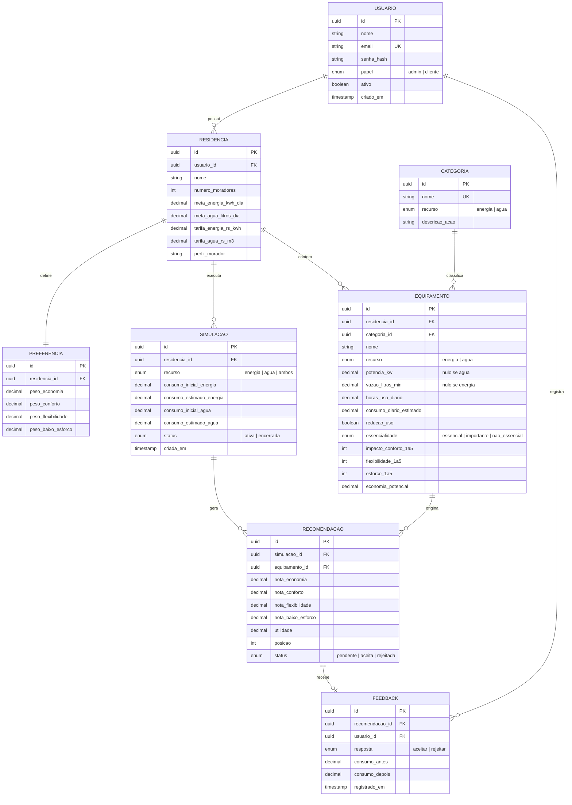
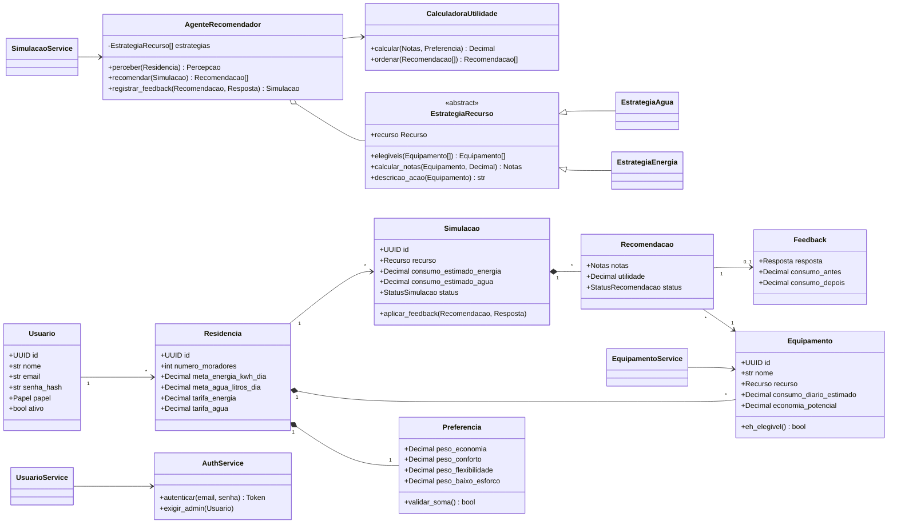
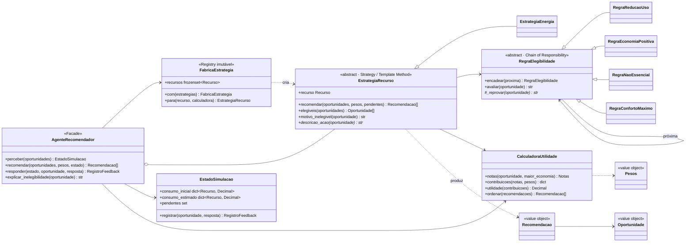

# Diagramas

## Diagrama ER (PostgreSQL)

```mermaid
erDiagram
    USUARIO ||--o{ RESIDENCIA : possui
    RESIDENCIA ||--|| PREFERENCIA : define
    RESIDENCIA ||--o{ EQUIPAMENTO : contem
    CATEGORIA ||--o{ EQUIPAMENTO : classifica
    RESIDENCIA ||--o{ SIMULACAO : executa
    SIMULACAO ||--o{ RECOMENDACAO : gera
    EQUIPAMENTO ||--o{ RECOMENDACAO : origina
    RECOMENDACAO ||--o| FEEDBACK : recebe
    USUARIO ||--o{ FEEDBACK : registra

    USUARIO {
        uuid id PK
        string nome
        string email UK
        string senha_hash
        enum papel "admin | cliente"
        boolean ativo
        timestamp criado_em
    }
    RESIDENCIA {
        uuid id PK
        uuid usuario_id FK
        string nome
        int numero_moradores
        decimal meta_energia_kwh_dia
        decimal meta_agua_litros_dia
        decimal tarifa_energia_rs_kwh
        decimal tarifa_agua_rs_m3
        string perfil_morador
    }
    PREFERENCIA {
        uuid id PK
        uuid residencia_id FK
        decimal peso_economia
        decimal peso_conforto
        decimal peso_flexibilidade
        decimal peso_baixo_esforco
    }
    CATEGORIA {
        uuid id PK
        string nome UK
        enum recurso "energia | agua"
        string descricao_acao
    }
    EQUIPAMENTO {
        uuid id PK
        uuid residencia_id FK
        uuid categoria_id FK
        string nome
        enum recurso "energia | agua"
        decimal potencia_kw "nulo se agua"
        decimal vazao_litros_min "nulo se energia"
        decimal horas_uso_diario
        decimal consumo_diario_estimado
        boolean reducao_uso
        enum essencialidade "essencial | importante | nao_essencial"
        int impacto_conforto_1a5
        int flexibilidade_1a5
        int esforco_1a5
        decimal economia_potencial
    }
    SIMULACAO {
        uuid id PK
        uuid residencia_id FK
        enum recurso "energia | agua | ambos"
        decimal consumo_inicial_energia
        decimal consumo_estimado_energia
        decimal consumo_inicial_agua
        decimal consumo_estimado_agua
        enum status "ativa | encerrada"
        timestamp criada_em
    }
    RECOMENDACAO {
        uuid id PK
        uuid simulacao_id FK
        uuid equipamento_id FK
        decimal nota_economia
        decimal nota_conforto
        decimal nota_flexibilidade
        decimal nota_baixo_esforco
        decimal utilidade
        int posicao
        enum status "pendente | aceita | rejeitada"
    }
    FEEDBACK {
        uuid id PK
        uuid recomendacao_id FK
        uuid usuario_id FK
        enum resposta "aceitar | rejeitar"
        decimal consumo_antes
        decimal consumo_depois
        timestamp registrado_em
    }
```

## Diagrama de classes (backend Python)

```mermaid
classDiagram
    direction LR

    class Usuario {
        +UUID id
        +str nome
        +str email
        +str senha_hash
        +Papel papel
        +bool ativo
    }
    class Residencia {
        +UUID id
        +int numero_moradores
        +Decimal meta_energia_kwh_dia
        +Decimal meta_agua_litros_dia
        +Decimal tarifa_energia
        +Decimal tarifa_agua
    }
    class Preferencia {
        +Decimal peso_economia
        +Decimal peso_conforto
        +Decimal peso_flexibilidade
        +Decimal peso_baixo_esforco
        +validar_soma() bool
    }
    class Equipamento {
        +UUID id
        +str nome
        +Recurso recurso
        +Decimal consumo_diario_estimado
        +Decimal economia_potencial
        +eh_elegivel() bool
    }
    class Simulacao {
        +UUID id
        +Recurso recurso
        +Decimal consumo_estimado_energia
        +Decimal consumo_estimado_agua
        +StatusSimulacao status
        +aplicar_feedback(Recomendacao, Resposta)
    }
    class Recomendacao {
        +Notas notas
        +Decimal utilidade
        +StatusRecomendacao status
    }
    class Feedback {
        +Resposta resposta
        +Decimal consumo_antes
        +Decimal consumo_depois
    }

    class AgenteRecomendador {
        -EstrategiaRecurso[] estrategias
        +perceber(Residencia) Percepcao
        +recomendar(Simulacao) Recomendacao[]
        +registrar_feedback(Recomendacao, Resposta) Simulacao
    }
    class EstrategiaRecurso {
        <<abstract>>
        +recurso Recurso
        +elegiveis(Equipamento[]) Equipamento[]
        +calcular_notas(Equipamento, Decimal) Notas
        +descricao_acao(Equipamento) str
    }
    class EstrategiaEnergia
    class EstrategiaAgua
    class CalculadoraUtilidade {
        +calcular(Notas, Preferencia) Decimal
        +ordenar(Recomendacao[]) Recomendacao[]
    }

    class UsuarioService
    class EquipamentoService
    class SimulacaoService
    class AuthService {
        +autenticar(email, senha) Token
        +exigir_admin(Usuario)
    }

    Usuario "1" --> "*" Residencia
    Residencia "1" *-- "1" Preferencia
    Residencia "1" *-- "*" Equipamento
    Residencia "1" --> "*" Simulacao
    Simulacao "1" *-- "*" Recomendacao
    Recomendacao "*" --> "1" Equipamento
    Recomendacao "1" --> "0..1" Feedback

    EstrategiaRecurso <|-- EstrategiaEnergia
    EstrategiaRecurso <|-- EstrategiaAgua
    AgenteRecomendador o-- EstrategiaRecurso
    AgenteRecomendador --> CalculadoraUtilidade
    SimulacaoService --> AgenteRecomendador
    UsuarioService --> AuthService
    EquipamentoService --> Equipamento
```

## Núcleo do agente (`app/agente/`, implementado)

Padrões em [padroes-de-projeto.md](padroes-de-projeto.md).

```mermaid
classDiagram
    direction LR

    class AgenteRecomendador {
        <<Facade>>
        +perceber(oportunidades) EstadoSimulacao
        +recomendar(oportunidades, pesos, estado) Recomendacao[]
        +responder(estado, oportunidade, resposta) RegistroFeedback
        +explicar_inelegibilidade(oportunidade) str
    }
    class FabricaEstrategia {
        <<Registry imutável>>
        +recursos frozenset~Recurso~
        +com(estrategias) FabricaEstrategia
        +para(recurso, calculadora) EstrategiaRecurso
    }
    class EstrategiaRecurso {
        <<abstract · Strategy / Template Method>>
        +recurso Recurso
        +recomendar(oportunidades, pesos, pendentes) Recomendacao[]
        +elegiveis(oportunidades) Oportunidade[]
        +motivo_inelegivel(oportunidade) str
        +descricao_acao(oportunidade)* str
    }
    class EstrategiaEnergia
    class RegraElegibilidade {
        <<abstract · Chain of Responsibility>>
        +encadear(proxima) RegraElegibilidade
        +avaliar(oportunidade) str
        #_reprovar(oportunidade)* str
    }
    class RegraReducaoUso
    class RegraEconomiaPositiva
    class RegraNaoEssencial
    class RegraConfortoMaximo
    class CalculadoraUtilidade {
        +notas(oportunidade, maior_economia) Notas
        +contribuicoes(notas, pesos) dict
        +utilidade(contribuicoes) Decimal
        +ordenar(recomendacoes) Recomendacao[]
    }
    class EstadoSimulacao {
        +consumo_inicial dict~Recurso, Decimal~
        +consumo_estimado dict~Recurso, Decimal~
        +pendentes set
        +registrar(oportunidade, resposta) RegistroFeedback
    }
    class Oportunidade {
        <<value object>>
    }
    class Pesos {
        <<value object>>
    }
    class Recomendacao {
        <<value object>>
    }

    AgenteRecomendador --> FabricaEstrategia
    AgenteRecomendador o-- EstrategiaRecurso
    AgenteRecomendador --> EstadoSimulacao
    AgenteRecomendador --> CalculadoraUtilidade
    FabricaEstrategia ..> EstrategiaRecurso : cria
    EstrategiaRecurso <|-- EstrategiaEnergia
    EstrategiaRecurso --> RegraElegibilidade
    EstrategiaRecurso --> CalculadoraUtilidade
    RegraElegibilidade <|-- RegraReducaoUso
    RegraElegibilidade <|-- RegraEconomiaPositiva
    RegraElegibilidade <|-- RegraNaoEssencial
    RegraElegibilidade <|-- RegraConfortoMaximo
    RegraElegibilidade --> RegraElegibilidade : próxima
    EstrategiaRecurso ..> Recomendacao : produz
    Recomendacao --> Oportunidade
    CalculadoraUtilidade ..> Pesos
```
